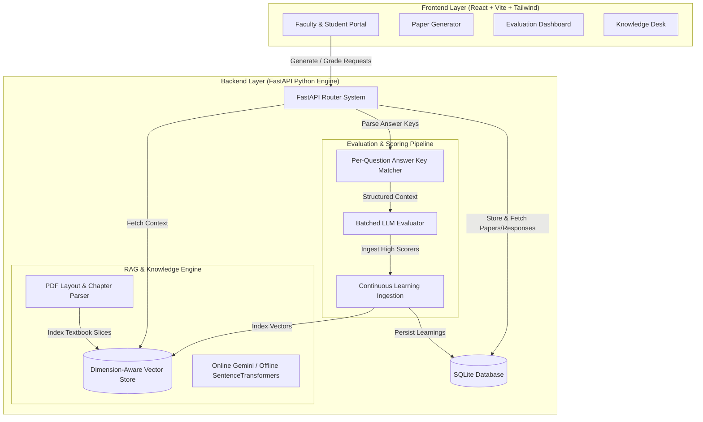

# 🛡️ DRISHTI AI
### Academic Examination Answer Generator, Evaluator & Grading Assistant

**DRISHTI AI** is an advanced, textbook-grounded educational intelligence platform designed to automate question paper generation, evaluate student submissions with high academic rigor, and power continuous curriculum learning. By combining Retrieval-Augmented Generation (RAG), strict answer key matching, local vector embeddings, and hardware-accelerated offline OCR, DRISHTI AI equips educators with a complete SaaS Command Center for examination management.

---

## 💡 Why DRISHTI AI?

Traditional AI grading often suffers from model hallucinations, loose scoring criteria, or missing textbook context. DRISHTI AI eliminates guesswork by enforcing a strict **Source Priority Hierarchy**:

1. **Priority 1: Official Teacher Answer Key & Marking Scheme** (Authoritative grading standard)
2. **Priority 2: Course Textbook Material** (Retrieved RAG context from verified syllabus PDFs)
3. **Priority 3: Question Paper Options & Structure**
4. **Priority 4: General Academic Knowledge**

### ✨ Key Capabilities

- 📄 **Dynamic Question Paper Generation**: Instantly generate structured question papers (MCQs, Short Answer, Long Answer) from uploaded textbook chapters alongside matching hidden Teacher Answer Keys.
- 🎯 **Fair & Rigorous Evaluation**:
  - **MCQs (1 Mark)**: Binary grading ($1.0$ or $0.0$). Student selections are strictly cross-checked against that specific question's model answer. Wrong options are penalized with $0$ marks and constructive feedback.
  - **Descriptive Questions**: Graded on concept accuracy and technical completeness grounded directly in textbook definitions.
- ⚡ **Lightning-Fast Batched Grading**: Evaluates entire student test submissions in single batched LLM calls with instant local fallback on rate limits ($< 0.1s$ response retrieval time).
- 🧠 **Continuous System Learning**: High-scoring verified student answers ($\ge 70\%$) are automatically ingested into system memory (`knowledge_enhancements` DB table & vector store) to continuously improve future model explanations.
- 📝 **Google Forms Integration**: Seamlessly connect Google Forms via Apps Script Web App to publish interactive tests and sync student responses automatically.
- 🔒 **Full Offline Capability**: Local sentence-transformer embeddings (`all-MiniLM-L6-v2`) and native macOS Vision OCR allow full grading & tutoring functionality even without active internet access.

---

## 🏗️ System Architecture



---

## 🛠️ Step-by-Step Setup & Installation Guide

Follow these instructions to set up and run DRISHTI AI on your machine.

### 1. Prerequisites
Ensure you have installed:
- **Node.js** (v18.0 or higher) & **npm**
- **Python** (v3.10 or higher) & **pip**
- **Git**

---

### 2. Repository Cloning & Environment Setup

1. Clone the repository and enter the project folder:
   ```bash
   git clone https://github.com/SURYANSH67/DRISHTI.git
   cd DRISHTI
   ```

2. Create a `.env` file in the project root (and inside `backend/.env`) with your API keys:
   ```env
   # LLM & Embedding API Keys
   GEMINI_API_KEY=your_google_gemini_api_key
   GROQ_API_KEY=your_groq_api_key
   OPENAI_API_KEY=your_openai_api_key (optional fallback)
   ```

---

### 3. Backend Setup

1. Open your terminal and navigate to the backend folder:
   ```bash
   cd backend
   ```

2. Create and activate a Python virtual environment:
   ```bash
   python3 -m venv venv
   source venv/bin/activate
   ```

3. Install required backend dependencies:
   ```bash
   pip install -r requirements.txt
   ```

4. Verify database initialization:
   ```bash
   python3 -c "from app.database import init_db; init_db()"
   ```

---

### 4. Frontend Setup

1. Open a new terminal tab and navigate to the frontend directory:
   ```bash
   cd frontend
   ```

2. Install Node modules:
   ```bash
   npm install
   ```

---

## 🚀 Running the Application

### Method 1: Automated Launch (Recommended)

To launch both the FastAPI backend server (Port `8000`) and the Vite frontend dev server (Port `5173`) simultaneously:

```bash
chmod +x run.sh
./run.sh
```

- **Frontend Portal**: Open `http://localhost:5173` in your browser.
- **Backend API Docs**: Accessible at `http://127.0.0.1:8000/docs`.

---

### Method 2: Manual Service Startup

#### Terminal 1 — Backend API Server:
```bash
cd backend
source venv/bin/activate
export PYTHONPATH=.
python3 app/main.py
```

#### Terminal 2 — Frontend Development Server:
```bash
cd frontend
npm run dev
```

---

### Method 3: Exposing Globally via Pinggy Tunnel (For Online Student Tests)

To share the portal online so students can attempt tests from any remote device:

```bash
chmod +x run_tunnel.sh
./run_tunnel.sh
```
This establishes a secure tunnel and displays a public HTTPS URL (e.g. `https://xxxx.run.pinggy-free.link`).

---

## 📝 Connecting Google Forms Integration

1. Open Google Drive and access **Google Apps Script** (`script.google.com`).
2. Copy the Apps Script code provided inside the DRISHTI AI Faculty Panel under **Connect Google Drive Integration** -> **Get Apps Script Code**.
3. Deploy the script as a **Web App**:
   - **Execute as**: `Me`
   - **Who has access**: `Anyone`
4. Copy the deployed Web App URL (starts with `https://script.google.com/macros/s/...`) and paste it into the **Apps Script Web App URL** field on the Faculty Panel.

---

## 📊 Database Schema (SQLite)

DRISHTI AI uses an SQLite database (`backend/data/drishti.db`) for lightweight, serverless persistence.

| Table Name | Description | Key Columns |
| :--- | :--- | :--- |
| `users` | User credentials & roles | `id`, `name`, `email`, `password_hash`, `role` |
| `books` | Uploaded syllabus textbook PDFs | `book_id`, `filename`, `subject_name`, `total_pages` |
| `question_papers` | Generated test papers & answer keys | `id`, `title`, `content`, `answer_key`, `google_form_url` |
| `form_responses` | Evaluated student submissions | `id`, `paper_id`, `student_name`, `marks_obtained`, `question_analysis` |
| `knowledge_enhancements` | Verified system learnings repository | `id`, `question`, `student_answer`, `official_answer`, `confidence_score` |

---

## 🔬 Local & Offline Verifications

To test local offline embeddings and native macOS Vision OCR page extraction without active internet connectivity:

```bash
export PYTHONPATH=backend
backend/venv/bin/python3 backend/app/services/evaluator.py
```

---

## 📁 Repository Directory Structure

```
DRISHTI/
├── backend/                  # FastAPI Application Engine
│   ├── app/
│   │   ├── main.py           # Server entrypoint & middleware configuration
│   │   ├── config.py         # Environment variables & system configuration
│   │   ├── database.py       # SQLite database initialization & tables
│   │   ├── routers/
│   │   │   ├── auth.py       # Authentication router
│   │   │   ├── books.py      # PDF parsing & textbook management router
│   │   │   ├── generator.py  # Question paper generation & grading router
│   │   │   └── dashboard.py  # Dashboard analytics & stats router
│   │   └── services/
│   │       ├── ai_service.py # Gemini, Groq, & local SentenceTransformers service
│   │       ├── evaluator.py  # Evaluation engine & macOS Vision OCR helper
│   │       ├── pdf_parser.py # Chapter layout & text parser
│   │       └── vector_store.py # Dimension-aware JSON vector store
│   ├── data/                 # SQLite database file & vector store files
│   └── requirements.txt      # Python dependencies
│
├── frontend/                 # React + TypeScript + Vite Application
│   ├── src/
│   │   ├── components/
│   │   │   ├── StudentPanel.tsx # Student dashboard & chapter tutor
│   │   │   ├── TeacherPanel.tsx # Faculty paper generator & evaluation hub
│   │   │   └── AdminPanel.tsx   # System administration panels
│   │   └── services/
│   │       └── api.ts        # Frontend HTTP API fetch client
│   └── package.json          # Node dependencies
│
├── run.sh                    # Unified local dev server launcher
└── run_tunnel.sh             # Public HTTPS tunnel launcher
```

---

## 🛡️ License & Acknowledgments

DRISHTI AI is designed for academic evaluation, research study, and examination generation. For contributions or feedback, please visit the official GitHub repository.
